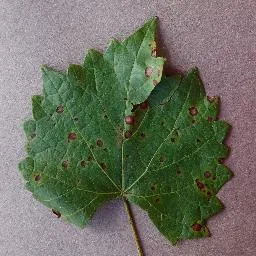
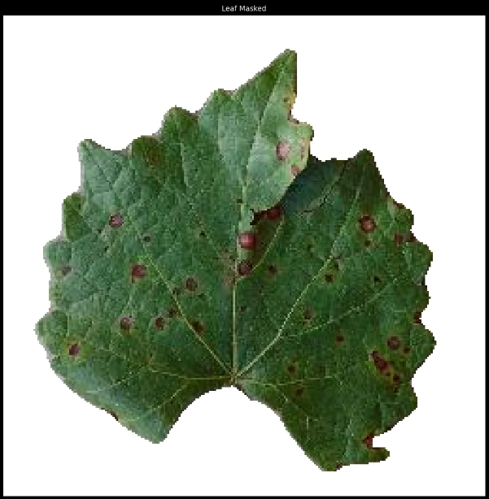

# leaffliction

Detect plant diseases from leaf photos.

## What is this?

You take a photo of a leaf. The computer tells you if it's healthy or sick.

## How does it work?

Plants look different when they're sick. The computer learns to spot these differences.

### 1. Take a photo



### 2. The computer finds the leaf

It ignores the background and focuses only on the leaf:



### 3. The computer looks for patterns

It analyzes the leaf's texture and color to find signs of disease:


### 4. Result

The computer predicts what disease the leaf has (or if it's healthy).

---

## Try it

Prewiewable/Clickable Gradio


## Installation

You need python, [uv](https://github.com/astral-sh/uv?tab=readme-ov-file#uv), make
```bash
git clone https://github.com/plagache/leaffliction
cd leaffliction
make setup
```

## Usage

```bash
# Activate the environment
source activate

# Transform images
python Transformation.py -src images -dst debug
```

## Debug

```bash
# display information about the nvidia graphic card in use
make nvidia

# dll and extract datasets
# make extract
make get_dateset

# display information about the distribution of the datasets
make distribution
```
